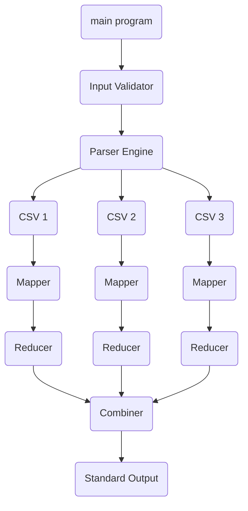
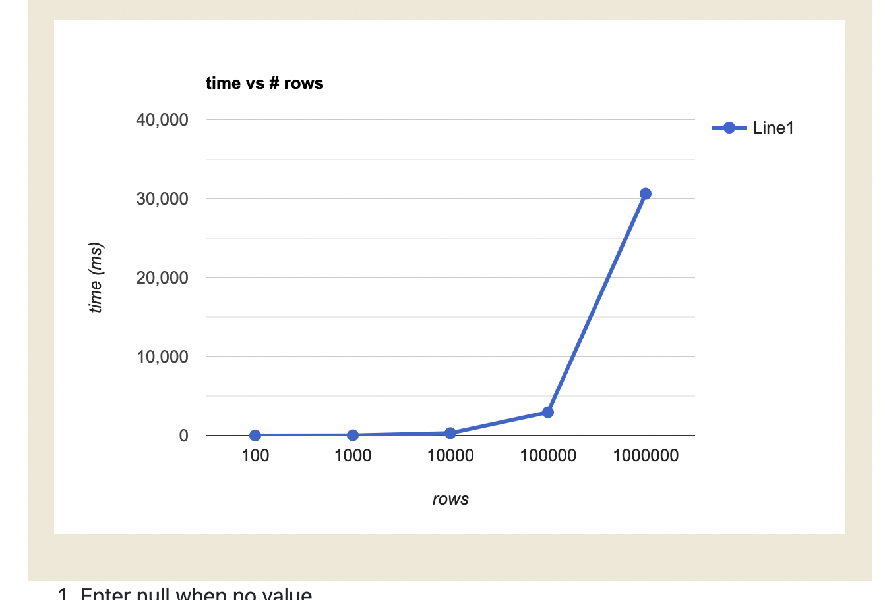
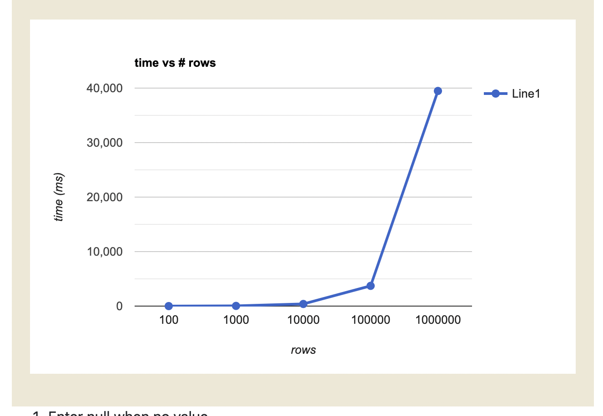

# CSV Combiner

The following program combines the data from multiple CSV files. One should specify where do these files live in.

You can run the program using the supplied test data, using the following command

```
go run . -dir data/simple
```

The program will double check that you passed the directory flag as a terminal argument and will throw an error if it's either malformed or missing.

Run the tests with the following command

```
go test -dir data/test
```

## Solution

My main intention was to simulate a Map-Reduce process with Go. As a result, I decided to use Go channels and routines to process each CSV file and finally, when all the data is processed and converted into proper a struct, it combines it using a hashmap and writes the output to the standard output.

This diagram illustrates how it works:



## Trade-offs

1. The program is memory constrained, loading all the CSV files into memory. Hence, it has memory limits based on the hardware it runs into

2. The program processes all the information from the CSV files and transforms it into a struct called UserInfo. This struct only supports strings. This is a known limitation and something that I would improve if I had more time to work on it.

3. I paid the overhead of marshalling/unmarshalling the data structures, as well as using reflect. First, I thougth that it would be better not to do it and work directly with hash maps. However, Go is a strongly typed language and I believe it would be preferrable to use types as much as we can. Moreover, thinking about real scenarios, it would be better to return a processed data structure with types to a client.

4. The composer uses a data structure called `lookupFields`. This array of strings determines which columns should be mapped out from the CSV file. I made this decision because in real life, I thought one could have a configurable set of keys to extract from these files to optimize the data processed and stored. This depends on what is the real use case, but I thought it would be nice to have a dynamic behavior for each client. Imagine that you grab the set of keys from an environment variable or we could store one set of keys per client in the database.

5. Thinking about Grax's real use cases, I'm not sure if this solution would work because I imagine the company has to work with more dynamic data structures, given that the exported Salesforce data is different for each company. However, the solution can scale if one has a proper configuration for each client. The MapReduce process is also scalable.

6. The merge mechanism does not override values that are empty. This means, if a value exists in two CSVs, and the second one is empty, the parser will keep the existing one.

## Future Improvements

1. Better error handling. At the moment, if you select a key in the `lookupFields` array and this key does not exist in the struct, the program will not fail but will pollute the output with `<invalid Value>`. I would handle better the files validation.

2. Process the CSV files using streams or another mechanism that optimizes how much data one loads into memory.

3. The `lookupFields` must match the columns from the CSV file. One could easily replace this array with the header because the method `GetHeaderIndexes` already works dynamically. So it would be really easy to replace it.

4. Add more tests

## Benchmarks

**Hardware**

Apple M1 Pro
Memory 16GB
1TB Flash Storage

**Results**

Results for 4 files


Results for 5 files


## Example

Given 4 CSV files:

```
Id,FirstName,LastName
1,Amy,Adams
2,John,Malkovich
```

```
Id,Phone,Email
1,310-111-1111,contact@amyadams.com
2,213-222-2222,john@malkovich.com
```

```
Id,FirstName,LastName
3,Larry,David
4,Michelle,Wolf
```

```
Id,Phone,Email
4,213-444-444,mwolf@comcast.net
```

The consolidated CSV could be:

```
Id,FirstName,LastName,Phone,Email
1,Amy,Adams,310-111-1111,contact@amyadams.com
2,John,Malkovich,213-222-2222,john@malkovich.com
3,Larry,David,,
4,Michelle,Wolf,213-444-444,mwolf@comcast.net
```

Note the columns could be in a different order: `Id,Phone,Email,FirstName,Lastname`.
